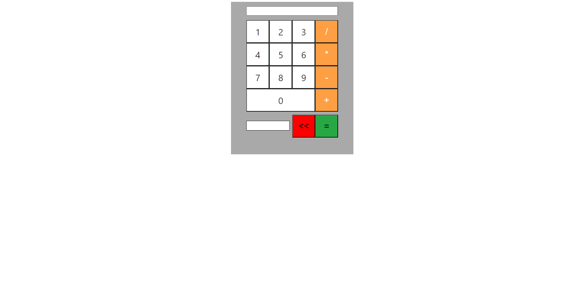

# JS Simple Calculator

JS Simple Calculator, temel matematiksel işlemleri gerçekleştiren bir hesap makinesi mini projesidir.

## Özellikler

- **Sayı Girişi:** 0-9 arası sayılarla hesaplama yapılabilir.
- **İşlemler:** Toplama, çıkarma, çarpma ve bölme işlemlerini destekler.
- **Sonuç Gösterimi:** Hesaplanan sonucu ekranda gösterir.
- **Silme:** Giriş alanlarını temizleyebilirsiniz.

## Ekran Görüntüsü

## Kurulum

Bu projeyi yerel bilgisayarınızda çalıştırmak için sadece projenin dosyalarını indirin ve index.html dosyasını çalıştırın.

## Dosya Yapısı

- `index.html`: HTML dosyası, uygulamanın temel yapısını içerir.
- `style.css`: CSS dosyası, uygulamanın stilini belirler.
- `script.js`: JavaScript dosyası, uygulamanın işlevselliğini sağlar.

## İletişim

Bu hesap makinesi mini projesi geliştirilmeye açık bir mini projedir. Proje hakkında herhangi bir sorunuz varsa, benimle iletişime geçebilirsiniz.

- E-posta: [erceyasinemre17@gmail.com](mailto:erceyasinemre17@gmail.com)
- Instagram: [ne_bilim17](https://www.instagram.com/ne_bilim17/)